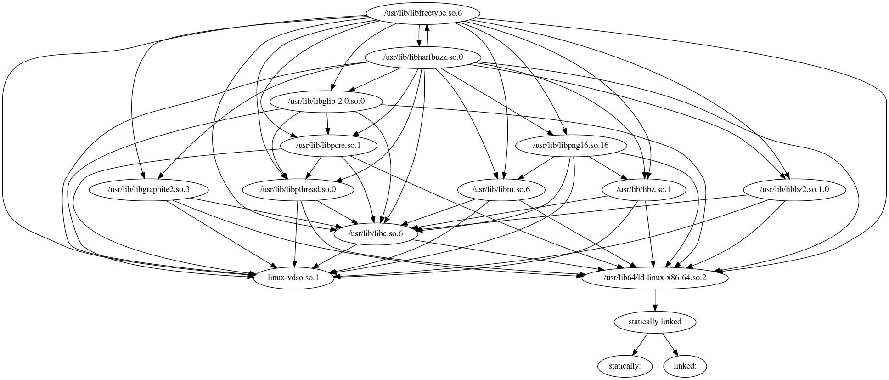

Last night I played with Go's "debug/elf" package and learned some interesting things about the ELF format.  
It started with a simple idea, how do I write my own `ldd` command?  
```
$ go doc debug/elf.File
type File struct {
        FileHeader
        Sections []*Section
        Progs    []*Prog

        // Has unexported fields.
}
    A File represents an open ELF file.


func (f *File) Close() error
func (f *File) DWARF() (*dwarf.Data, error)
func (f *File) DynString(tag DynTag) ([]string, error)
func (f *File) DynamicSymbols() ([]Symbol, error)
func (f *File) ImportedLibraries() ([]string, error)
func (f *File) ImportedSymbols() ([]ImportedSymbol, error)
func (f *File) Section(name string) *Section
func (f *File) SectionByType(typ SectionType) *Section
func (f *File) Symbols() ([]Symbol, error)
```
Now I roughly know how  
```
package main

import "fmt"
import "os"
import "debug/elf"

func main() {
        f, err := elf.Open(os.Args[1])
        if err != nil {
                panic(err)
        }
        libs, err := f.ImportedLibraries()
        if err != nil {
                panic(err)
        }
        for _, lib := range libs {
                fmt.Println(lib)
        }
}
```
Let me test it  
```
$ go run ldd.go /sbin/init
libpthread.so.0
libc.so.6
libsystemd-shared-241.so
librt.so.1
libseccomp.so.2
libmount.so.1
libpam.so.0
libaudit.so.1
libkmod.so.2
```
Okay, works great!!  
The natural next thing to do is to implement `lddtree`  
which basically requires you run `ldd` on your output recursively, generating a tree-ish structure

But `ldd` is dumb. Given the `.so` library name, ldd won't do anything useful. You need full path to the `.so` library file.

`ldconfig -p` knows that! Under the hood `ldconfig` reads from `/etc/ld.so.cache`
Everything you see in `ldconfig -p` comes from `/etc/ld.so.cache`
Then the problem becomes: how do I parse /etc/ld.so.cache (hopefully in Go)?

```
$ lddtree /bin/ldconfig
/bin/ldconfig (interpreter => None)
```
First idea was to read glibc/ldconfig.c, and translate it go Go
After some attempt I gave up. GNU code simply doesn't make sense to me

"https://github.com/search?q=parsing /etc/ld.so.cache&type=Code"
I then found [klueska/libelfutils](https://github.com/klueska/libelfutils) which does exactly what I wanted.
I played with it for a while. The C code was readable but first let me see if there are any Go libraries for that...

"https://godoc.org/?q=ldcache"
a quick search led me to [this package](https://godoc.org/github.com/rai-project/ldcache)
[here](https://godoc.org/github.com/rai-project/ldcache?importers) I found an [example](https://github.com/rai-project/docker/blob/master/cuda/volumes.go) on how to use it.

I knew I was close to the answer...

2 hours later I ended up with [lddtree.go](https://gist.github.com/685e541fe27f20fb5a9682793a93f5cd)
It's badly written and could be refactored to look nicer. I promise I'll do that when I'm free...

Typical output:
```
$ go run lddtree.go /bin/ls                                                                                                                                      [0/1922]
2019/03/24 22:32:32 3
2019/03/24 22:32:32 2
2019/03/24 22:32:32 3
2019/03/24 22:32:32 2
2019/03/24 22:32:32 1
{
  "Name": "ls",
  "Path": "/bin/ls",
  "Childs": [
    "libcap.so.2",
    "libc.so.6"
  ],
  "Children": [
    {
      "Name": "libcap.so.2",
      "Path": "/usr/lib/libcap.so.2.26",
      "Childs": [
        "libc.so.6"
      ],
      "Children": [
        {
          "Name": "libc.so.6",
          "Path": "/usr/lib/libc-2.28.so",
          "Childs": [
            "ld-linux-x86-64.so.2"
          ],
          "Children": [
            {
              "Name": "ld-linux-x86-64.so.2",
              "Path": "/usr/lib/ld-2.28.so",
              "Childs": [],
              "Children": []
            }
          ]
        }
      ]
    },
    {
      "Name": "libc.so.6",
      "Path": "/usr/lib/libc-2.28.so",
      "Childs": [
        "ld-linux-x86-64.so.2"
      ],
      "Children": [
        {
          "Name": "ld-linux-x86-64.so.2",
          "Path": "/usr/lib/ld-2.28.so",
          "Childs": [],
          "Children": []
        }
      ]
    }
  ]
}
```

Weired thing happened when I do 
```
go run lddtree.go /usr/bin/vim # part of gvim
...
panic: open /usr/lib/ld-2.28.so: too many open files
```

the error persists even after I do `ulimit -n 100000` to raise open file limit

However the real `lddtree` doesn't have this problem
I decide to find out which one of the dependencies causes the problem
```
$ cat lddtree.note
lddtree /usr/bin/vim | cut -d = -f 2 | sed 1d | cut -d ' ' -f 2 | grep -v /usr/lib/libgtk-3.so.0 | grep -v /usr/lib/libcairo-gobject.so.2 | grep -v /usr/lib/libfribidi.so.0 | grep -v /usr/lib/libharfbuzz.so.0 | grep -v /usr/lib/libpangoft2-1.0.so.0 | grep -v /usr/lib/libfontconfig.so.1 | grep -v /usr/lib/libfreetype.so.6 | grep -v /usr/lib/libgdk-3.so.0 | grep -v /usr/lib/libpangocairo-1.0.so.0 | grep -v
/usr/lib/libcairo.so.2 | xargs -L1 go run ~/lddtree.go
```

```
 $ cat lddtree.note | tr '|' '\n' | grep grep
 grep -v /usr/lib/libgtk-3.so.0
 grep -v /usr/lib/libcairo-gobject.so.2
 grep -v /usr/lib/libfribidi.so.0
 grep -v /usr/lib/libharfbuzz.so.0
 grep -v /usr/lib/libpangoft2-1.0.so.0
 grep -v /usr/lib/libfontconfig.so.1
 grep -v /usr/lib/libfreetype.so.6
 grep -v /usr/lib/libgdk-3.so.0
 grep -v /usr/lib/libpangocairo-1.0.so.0
 grep -v /usr/lib/libcairo.so.2
```

Any of those listed above will make `lddtree.go` crash

With `lddtree` you can see what's going on
```
$ lddtree /usr/lib/libharfbuzz.so.0
/usr/lib/libharfbuzz.so.0 (interpreter => None)
    libm.so.6 => /usr/lib/libm.so.6
        ld-linux-x86-64.so.2 => /usr/lib/ld-linux-x86-64.so.2
    libglib-2.0.so.0 => /usr/lib/libglib-2.0.so.0
        libpthread.so.0 => /usr/lib/libpthread.so.0
        libpcre.so.1 => /usr/lib/libpcre.so.1
    libfreetype.so.6 => /usr/lib/libfreetype.so.6
        libbz2.so.1.0 => /usr/lib/libbz2.so.1.0
        libpng16.so.16 => /usr/lib/libpng16.so.16
        libz.so.1 => /usr/lib/libz.so.1
        libharfbuzz.so.0 => /usr/lib/libharfbuzz.so.0
        libfreetype.so.6 => !!! circular loop !!!
    libgraphite2.so.3 => /usr/lib/libgraphite2.so.3
    libc.so.6 => /usr/lib/libc.so.6
```

```
$ lddtree /usr/lib/libharfbuzz.so.0
/usr/lib/libharfbuzz.so.0 (interpreter => None)
    libm.so.6 => /usr/lib/libm.so.6
        ld-linux-x86-64.so.2 => /usr/lib/ld-linux-x86-64.so.2
    libglib-2.0.so.0 => /usr/lib/libglib-2.0.so.0
        libpthread.so.0 => /usr/lib/libpthread.so.0
        libpcre.so.1 => /usr/lib/libpcre.so.1
    libfreetype.so.6 => /usr/lib/libfreetype.so.6
        libbz2.so.1.0 => /usr/lib/libbz2.so.1.0
        libpng16.so.16 => /usr/lib/libpng16.so.16
        libz.so.1 => /usr/lib/libz.so.1
        libharfbuzz.so.0 => /usr/lib/libharfbuzz.so.0
        libfreetype.so.6 => !!! circular loop !!!
    libgraphite2.so.3 => /usr/lib/libgraphite2.so.3
    libc.so.6 => /usr/lib/libc.so.6
```

/usr/lib/libharfbuzz.so.0 and libfreetype.so.6 are mutually dependent

pacman confirms this:
```
(ins)aaron@blackarcher ~/lddgraph $ pacman -Qi harfbuzz
Name            : harfbuzz
...
Depends On      : glib2  freetype2  graphite
...

(ins)aaron@blackarcher ~/lddgraph $ pacman -Qi freetype2
Name            : freetype2
...
Depends On      : zlib  bzip2  sh  libpng  harfbuzz
...

```
you can even visualize it with [lddgraph](https://github.com/bbenoist/lddgraph)
```
./lddgraph /usr/lib/libfreetype.so.6 -e /tmp/wtf.jpg
```


So it's not completely my fault that `lddtree.go` never finished on /usr/bin/vim. 
The existence of mutually dependent libraries (in this case freetype2 and harfbuzz) breaks the tree model in my program
(https://www.quora.com/How-are-directed-acyclic-graphs-different-from-trees)
and currently I haven't implemented loop detection like what `lddtree` does
